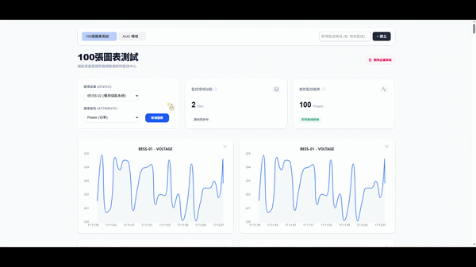
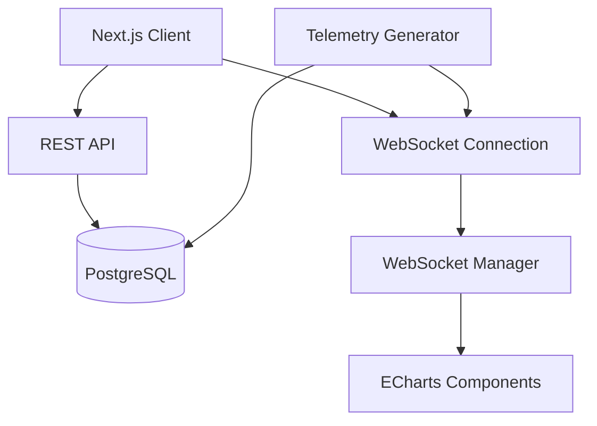

<a id="回到最頂端"></a>

# Energy Data Dashboard

一個面向能源監控場景的即時 Telemetry Dashboard，支援多圖表自由組裝、WebSocket 即時串流，以及可擴充的前後端架構設計。

---

## README 導覽

- [怎麼跑起來(pnpm install、pnpm dev 等)](#如何啟動專案)
- [用了哪些技術，為什麼選這些（特別是 chart library 和 ORM）](#技術選型)
- [Live update 我選了 polling 還是 WebSocket，為什麼？](#live-update-機制)
- [做了哪些 bonus](#bonus-完成情況)
- [如果再多給我一週，我會優先做什麼？](#未來優化方向)
- [開發過程中遇到什麼卡關，怎麼解的（或我目前還沒解的）](#開發挑戰與解法)
- [協助來源：我用了哪些 AI 工具，哪些部分主要靠 AI ？](#開發協助與-ai-工具)

## 專案展示

- 🔗 [Live Demo](https://poxa-energy-assessment.vercel.app/?dbId=5a5dd006-aac6-48d4-b2d0-92d7456cfdf0)

### 操作流程展示

- 建立 Dashboard
- 新增 Telemetry 圖表
- 接收即時資料更新
- 切換不同 Dashboard
- 移除圖表



- 🔗 [高畫質展示影片](https://github.com/user-attachments/assets/5d4eca83-19dd-4bd9-ad11-8ad26d90ec4b)

## 核心特色

- 支援多張圖表動態新增與刪除
- 使用 WebSocket 即時更新 telemetry
- Dashboard 狀態持久化於 PostgreSQL
- 支援多 Dashboard 切換與 URL 狀態同步
- 使用 ECharts + Canvas 處理高頻時間序列資料

## 技術棧（Tech Stack）

- Frontend：Next.js 14（App Router）、TypeScript、Tailwind CSS
- Backend：Node.js + TypeScript
- Database：PostgreSQL + Drizzle ORM
- Realtime：WebSocket
- Charting：Apache ECharts
- Infrastructure：Docker Compose

## 系統架構概覽



## 資料流架構（Data Flow）

1. Frontend 透過 REST API 載入 Dashboard 與歷史 Telemetry 資料
2. WebSocket 持續接收即時 Telemetry 更新
3. WebSocket Manager 根據 device / attribute 分發資料
4. Chart 元件增量更新 ECharts Instance
5. PostgreSQL 持久化 Dashboard 與 Telemetry 資料

## 核心架構決策

| 問題                   | 採用方案                    | 原因                                  |
| ---------------------- | --------------------------- | ------------------------------------- |
| 高頻 Telemetry 更新    | WebSocket                   | 降低 Polling 所產生的額外 HTTP 負擔   |
| 大量時間序列渲染       | ECharts（Canvas）           | 相較 SVG 在大量資料下效能更穩定       |
| 多圖表訂閱管理         | Shared WebSocket Manager    | 避免瀏覽器建立過多 WebSocket 連線     |
| Dashboard 狀態持久化   | PostgreSQL + Drizzle        | 兼顧資料持久化與團隊技術棧一致性      |
| Offscreen 圖表渲染成本 | IntersectionObserver        | 暫停不可視圖表的更新處理              |
| React re-render 壓力   | Incremental ECharts Updates | 降低高頻資料更新造成的 React 重繪成本 |

## 專案結構

```text
.
├── assets/                  # README demo gif / screenshots
├── docs/                    # AI collaboration & architecture notes
│
├── backend/
│   ├── db/
│   │   ├── schema.ts        # Drizzle database schema
│   │   └── index.ts         # Database connection
│   │
│   ├── routes/
│   │   ├── charts.ts        # Chart related APIs
│   │   ├── dashboards.ts    # Dashboard CRUD APIs
│   │   └── telemetry.ts     # Telemetry APIs
│   │
│   ├── services/
│   │   └── backgroundTasks.ts
│   │                          # Telemetry generator & cleanup jobs
│   │
│   ├── server.ts            # Express/WebSocket server entry
│   ├── drizzle.config.ts
│   └── Dockerfile
│
├── frontend/
│   ├── src/
│   │   ├── app/             # Next.js App Router
│   │   │
│   │   ├── components/
│   │   │   ├── ui/          # Shared reusable UI components
│   │   │   ├── ChartGrid.tsx
│   │   │   ├── ChartWidget.tsx
│   │   │   ├── DashboardTabs.tsx
│   │   │   └── ChartToolbar.tsx
│   │   │
│   │   ├── hooks/           # Custom hooks & business logic
│   │   │   ├── useCharts.ts
│   │   │   ├── useTelemetry.ts
│   │   │   ├── useDashboards.ts
│   │   │   └── useVisibility.ts
│   │   │
│   │   ├── lib/
│   │   │   ├── websocket.ts # Shared WebSocket manager
│   │   │   ├── configs.ts
│   │   │   └── chart/
│   │   │
│   │   ├── constants/
│   │   ├── types/
│   │   └── utils/
│   │
│   ├── public/
│   └── next.config.ts
│
├── docker-compose.yml
└── README.md
```
<a id="如何啟動專案"></a>

# 1. 怎麼跑起來（pnpm install、pnpm dev 等）

## 本地啟動方式（Local Setup）

本專案包含前端、後端與 PostgreSQL 資料庫，請先確認環境已安裝：

- Node.js（v20+）
- Docker

### 1. 啟動基礎服務

於專案根目錄執行：

```bash
docker compose up --build -d
```

---

### 2. 啟動 Backend

```bash
cd backend

cp .env.example .env

npm install

npx drizzle-kit push

npm run dev
```

---

### 3. 啟動 Frontend

```bash
cd frontend

npm install

npm run dev
```

---

啟動完成後，請開啟：

```txt
http://localhost:3000
```

- [回到最頂端](#回到最頂端)

<a id="技術選型"></a>

# 2. 用了哪些技術，為什麼選這些（特別是 chart library 和 ORM）

## 為什麼選擇 Apache ECharts？

本專案主要面向能源監控場景中的高頻 Telemetry 資料，因此在圖表庫選型時，我特別重視：

- 大量時間序列資料的渲染能力
- 高頻更新下的效能穩定性
- 即時 Dashboard 的互動體驗

綜合評估後，最終選擇使用 Apache ECharts。

### 1. Canvas Rendering 更適合大量時間序列資料

能源 Telemetry 資料會隨時間持續累積，若圖表同時需要呈現數千甚至上萬筆資料，基於 SVG 的圖表庫通常會產生大量 DOM 節點，容易導致畫面卡頓與記憶體壓力。

ECharts 預設以 Canvas 作為主要渲染方式，在大量資料場景下能提供更穩定的效能與記憶體表現。

### 2. 對即時 Dashboard 場景支援成熟

ECharts 內建：

- Tooltip
- Data Zoom
- Axis Pointer
- Brush
- Animation

等完整互動能力，能有效降低 Dashboard 類型產品的額外開發成本。

### 3. 降低 React 重繪壓力

Telemetry 更新頻率高，如果每次資料更新都完全交由 React State 驅動，當圖表數量增加後，容易產生大量不必要的 re-render。

因此本專案將圖表更新邏輯盡量交由 ECharts Instance 自身處理，而 React 主要負責：

- 管理資料流
- 管理 Chart Configuration
- 控制元件生命週期

藉此降低 React 在高頻更新場景下的渲染壓力。

---

## 為什麼選用 Drizzle ORM？

### 1. 團隊技術棧對齊（Team Alignment）

由於團隊目前主要使用 `Drizzle ORM`，為了在未來能更快速地接軌既有專案與協作流程，因此本專案直接採用相同技術棧進行開發。

### 2. 更貼近原生 SQL，便於掌控查詢效能

相較於高度抽象化的 ORM，Drizzle 的 API 設計更貼近原生 SQL。

在能源監控場景中，未來很容易出現：

- 聚合查詢（Aggregation）
- Group By
- 時間區間統計
- 大量 Timeseries 分析

等需求。

Drizzle 能讓我更直覺地掌控 SQL 行為與查詢效能。

### 3. 純 TypeScript Schema，型別一致性更高

Drizzle 直接使用 TypeScript 定義 Schema，不需要額外學習獨立 DSL（Domain Specific Language）。

這讓資料表型別能自然串接：

- Database
- API Layer
- Frontend Types

降低型別不一致與資料結構錯誤的風險。

---

- [回到最頂端](#回到最頂端)

<a id="live-update-機制"></a>

# 3. Live update 我選了 polling 還是 WebSocket，為什麼？

Telemetry 屬於持續更新的即時資料，因此本專案選擇使用 `WebSocket`，而非傳統 Polling。

若採用 Polling，當更新頻率提高後，會產生大量重複 HTTP Request，進一步增加：

- Server 負擔
- Network Overhead
- Client 不必要的重新請求

WebSocket 建立長連線後，Server 可以主動推送資料，更符合即時 Dashboard 的需求。

### WebSocket Manager

此外，前端額外實作了一層 WebSocket Manager。

原因在於：

若每張圖表都各自建立 WebSocket 連線，當 Dashboard 同時存在大量 Chart 時，瀏覽器連線數量會快速增加。

因此目前整個 Frontend 僅維持：

- 單一 WebSocket 連線
- 統一資料接收入口

再由 Manager 根據：

- deviceId
- attribute

將資料分發給對應的 Chart 元件。

這樣能有效降低：

- 瀏覽器連線成本
- 重複訂閱問題
- WebSocket 管理複雜度

- [回到最頂端](#回到最頂端)

---

<a id="bonus-完成情況"></a>

# 4. 做了哪些 bonus

### Bonus 任務對標實作

- **Bonus 1 - 視覺風格優化**
  整體 UI 參考 POXA 能源監控系統的設計風格。
- **Bonus 2 - 後端持久化與 Docker 容器化**
  所有 Dashboard 配置與圖表組合皆透過 `Drizzle ORM` 持久化至 `PostgreSQL`，確保重新整理頁面或跨裝置使用時狀態不遺失，並透過 `Docker Compose` 支援一鍵啟動完整開發環境。

- **Bonus 3 - 後端即時 Mock Data 與自動清理機制**
  後端實作常駐型 Background Tasks（`startBackgroundTasks`），模擬真實 IoT 場域中的高頻 Telemetry 更新情境：
  1. **動態資料生成**
     Server 啟動後，每秒自動生成 Timeseries Telemetry 資料，並同步寫入 PostgreSQL 與透過 WebSocket 即時廣播。
  2. **自動清理機制**
     為避免大量測試資料長時間累積造成資料庫膨脹，額外實作定時 Cleanup Job，每分鐘自動清除 5 分鐘前的歷史資料，維持本地開發環境的穩定性。

- **Bonus 4 - URL 狀態同步（Single Source of Truth）**
  將當前 Dashboard 狀態同步至 URL Query String（例如 `?dbId=xxx`），讓使用者可以直接分享相同 Dashboard View，同時也讓 Router 成為前端唯一狀態來源，降低狀態同步複雜度。

- **Bonus 5 - 多組 Dashboard 管理**
  支援多組 Dashboard 的建立、命名、切換與刪除，模擬多場域（Multi-site）監控情境，且每組 Dashboard 的圖表配置皆獨立持久化於資料庫中。

* **Bonus 6 - 與 AI 協作的真實痕跡**
  保留實際與 AI 協作過程中的架構討論、Code Review、效能優化與重構紀錄，包含拒絕 AI 過度工程建議的實際案例，用於展示開發過程中的工程判斷與架構取捨。詳見下方專節。

* **Bonus 7 - 100 個場域極端效能思考題**：針對高頻率、大量資料湧入的前端效能瓶頸，提出了具體的架構防禦策略，詳見下方專節。

---

## Bonus 7 思考題

## 如果這個 dashboard 要顯示 100 個 BESS 場域、每個場域每秒回傳一筆 telemetry，前端會遇到什麼問題？你會怎麼處理？

### 可能面臨的問題

#### 1. 高頻 State Update 與 React Re-render 壓力

若每筆 Telemetry 更新都直接觸發 React State 更新，當大量資料同時湧入時，容易造成頻繁 re-render，進一步影響畫面流暢度與互動體驗。

#### 2. 長時間 Timeseries 累積導致記憶體膨脹

Telemetry 屬於持續累積的時間序列資料。

若前端長時間無限制地將資料持續推入記憶體陣列中，瀏覽器記憶體使用量將持續成長，最終可能導致 Memory Leak 或頁面崩潰。

#### 3. 大量圖表渲染造成 DOM 與 GPU 壓力

若同時渲染 100 張以上圖表，且圖表庫基於 SVG Rendering，將產生大量 DOM 節點，容易導致：

- Layout 計算成本上升
- Repaint/Reflow 增加
- GPU 與主執行緒負載過高

最終造成畫面卡頓。

---

## 我的架構防禦策略

### 1. 【已實作】IntersectionObserver Lazy Rendering + Canvas Rendering

#### 僅更新可視區域內的圖表

目前專案已透過 `IntersectionObserver` 監聽圖表可視狀態。

只有當 Chart 進入使用者目前可視區域時，才會：

- 建立 WebSocket Subscription
- 接收即時資料
- 更新圖表內容

當圖表離開視窗後，則會暫停更新與資料訂閱。

這樣能有效避免背景中不可視圖表持續消耗：

- CPU
- Memory
- Rendering Cost

經過實測，即使同時建立大量圖表，頁面依然能維持流暢操作。

#### 採用 Canvas-based Chart Rendering

本專案選用基於 Canvas Rendering 的 Apache ECharts。

相較於 SVG Rendering：

- DOM 數量更少
- 大量資料渲染效能更穩定
- 更適合高頻 Timeseries 場景

因此更符合能源監控 Dashboard 的需求。

- [回到最頂端](#回到最頂端)

---

<a id="未來優化方向"></a>

# 5. 如果再多給我一週，我會優先做什麼？

若有額外開發時間，我會優先補強以下兩個方向：

- Dashboard 使用者體驗
- 系統可靠度與可維護性

---

### 1. 圖表拖曳排序與版面配置能力

#### 現況

目前 Dashboard 中的圖表採固定順序排列，缺乏更靈活的版面配置能力。

#### 預計優化方向

前端預計導入 `dnd-kit` 實作高流暢度的 Grid Drag-and-Drop。

後端則會於 Drizzle Schema 中新增：

- `order`
- `position`

等欄位，用於持久化圖表版面資訊。

完成後，使用者將可以：

- 自由拖曳圖表排序
- 客製化 Dashboard Layout
- 長期保存個人化配置

進一步提升 Dashboard 的實際使用體驗。

---

### 2. 自動化測試與穩定性防禦

#### 現況

目前專案開發重點放在核心功能與架構驗證，因此尚未完整導入自動化測試。

#### 預計優化方向

##### Unit Test

針對：

- Custom Hooks
- WebSocket 流程
- 非同步資料處理

建立單元測試。

例如：

- WebSocket 斷線重連
- API Error Handling
- State Synchronization

等情境。

藉此提升高頻即時資料場景下的穩定性。

##### E2E Test

預計導入：

- Playwright

等工具，建立完整使用者流程測試。

包含：

1. 建立 Dashboard
2. 選擇 Device 與 Attribute
3. 新增 Chart
4. 接收即時資料
5. 刪除 Chart

確保未來進行重構或功能擴充時，核心商業流程不被破壞。

- [回到最頂端](#回到最頂端)

---

<a id="開發挑戰與解法"></a>

# 6. 開發過程中遇到什麼卡關，怎麼解的（或我目前還沒解的）

在本次專案中，基礎功能開發（例如 API 串接、UI 建置）推進相對順利。

真正花費較多時間的部分，主要集中在：

- 前端架構拆分
- 即時資料流設計
- AI 生成程式碼的驗證與重構

這也是本次開發過程中最有收穫的部分。

---

### 1. AI 協作中的驗證與 Code Review

#### 面臨的問題

AI 能快速生成程式碼與提供實作方向，但在高頻非同步場景中，仍容易出現：

- 過時語法
- 不符合 React 生態的寫法
- 不必要的複雜抽象
- 與實際資料流不一致的邏輯

部分建議在表面上看似合理，但實際導入後可能會：

- 增加重繪成本
- 提高狀態管理複雜度
- 產生潛在效能問題

#### 我的處理方式

在開發過程中，我將 AI 定位為：

- Pair Programming Assistant
- Boilerplate Generator
- Code Review 參考來源

而非直接接受所有架構建議。

實際開發時，我仍會：

- 檢查與 Database Schema 是否一致
- 確認是否符合 React 最佳實踐
- 評估是否產生額外 Render Cost

這也讓我更深刻體會到：

> AI 能提升開發速度，但最終仍需要由開發者負責架構判斷與程式品質。

---

### 2. 避免 God Component 與主動架構重構

#### 面臨的問題

隨著功能逐漸增加，主頁面 `page.tsx` 一度同時負責：

- API 請求
- WebSocket 管理
- URL State Synchronization
- Dashboard 狀態管理
- UI Rendering

逐漸演變成典型的 God Component。

這會導致：

- 元件職責不清
- 可維護性下降
- 測試困難
- 後續擴充成本提高

#### 我的處理方式

後續主動進行架構拆分與重構：

##### UI Component 拆分

將純 UI 元件拆分為：

- `DashboardTabs`
- `ChartToolbar`
- `ChartGrid`
- `ChartWidget`

降低頁面層級的 UI 複雜度。

##### Business Logic Hook 化

將資料流與狀態邏輯抽離為：

- `useCharts`
- `useTelemetry`
- `useDashboards`
- `useVisibility`

等 Custom Hooks。

讓：

- UI Rendering
- State Management
- Side Effect

彼此職責分離。

- [回到最頂端](#回到最頂端)

---

<a id="開發協助與-ai-工具"></a>

# 7. 協助來源：我用了哪些 AI 工具，哪些部分主要靠 AI ？

## AI 工具使用方式

本專案開發過程中，主要使用：

- Gemini
- ChatGPT

作為：

- Pair Programming Assistant
- Boilerplate Generator
- Code Review 參考來源

AI 協助的部分主要集中在：

- API 基礎串接
- TypeScript 型別補全
- UI 初版生成
- Hook 結構討論
- ECharts 配置整理
- 架構方向驗證

而：

- 系統架構設計
- 資料流規劃
- 效能取捨
- React 狀態管理

則由我自行決定與重構。

---

## 與 AI 協作過程中的實際問題

我認為 AI 最大的價值在於：

- 提升開發速度
- 提供不同實作方向
- 協助快速驗證想法

但在高頻即時資料場景中，AI 仍容易產生：

- 過度工程
- 不必要抽象
- 與實際資料流不一致的實作
- React 生態已不推薦的寫法

因此在開發過程中，我會持續進行：

- 壓力測試
- Render Cost 檢查
- 架構複雜度評估

## 避免直接接受所有 AI 提議。

另外在驗證過程中，我也發現 AI 曾產生：

- `API_BASE_URL` 拼接錯誤
- 不符合實際 Schema 的資料格式

等 Hallucination 問題。

因此整個開發過程中，我會將 AI 生成內容視為：

- 參考方案
- 初稿
- 討論對象

而非直接採用的最終答案。

---

## AI 協作紀錄

開發過程中的部分架構討論與 AI 協作紀錄如下：

- [Gemini Code Review 與 100 張圖表效能討論](./docs/Gemini-自已CodeReview&壓力測試.md)
- [WebSocket 效能優化與 React 架構重構](./docs/React-WebSocket-優化與重構.md)
- [ChatGPT Code Review 與最終架構取捨](./docs/ChatGPT-CodeReview-拒絕建議.md)
- [回到最頂端](#回到最頂端)

---
